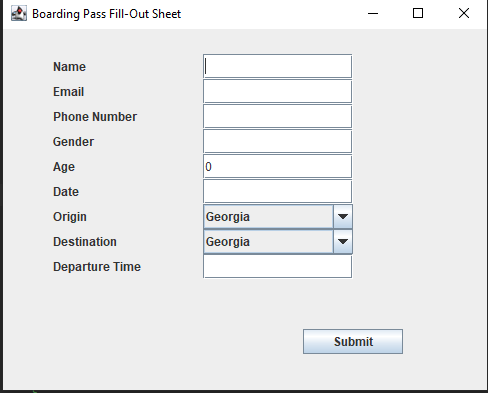

# Boarding-Pass
create a boarding pass generator for the customer

GUI has been included for customer's UI/UX
After customer fills out the survey their information will be stored into a textfile 

  

it will calculate time estimation and price and will automatically generate boarding pass number

created a management software in order to edit individual boarding pass of each customer 
user will first have to choose the boarding pass number in order to perform edits
