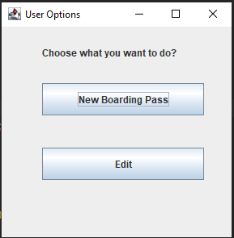
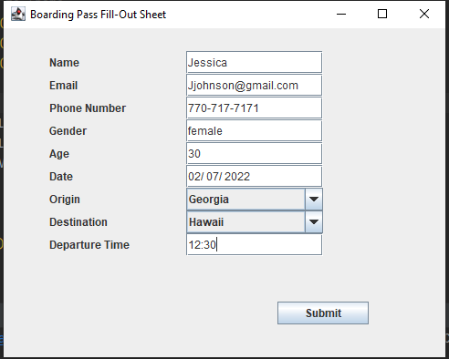
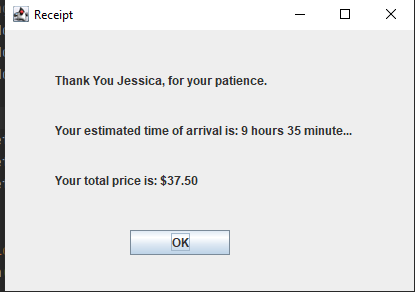
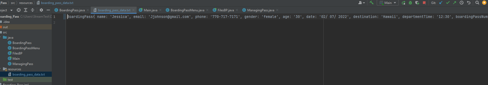
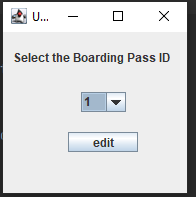
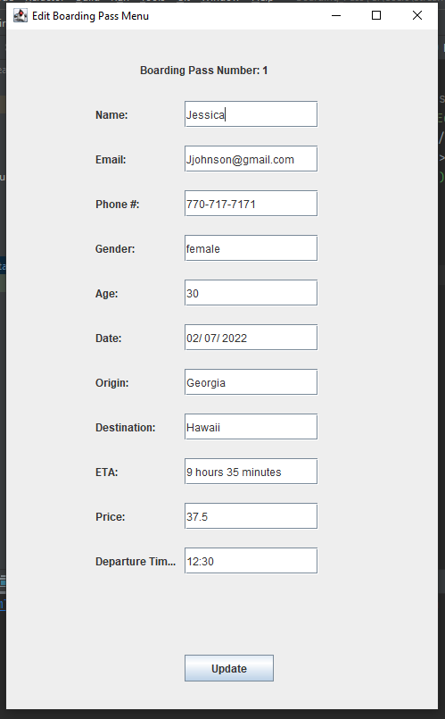
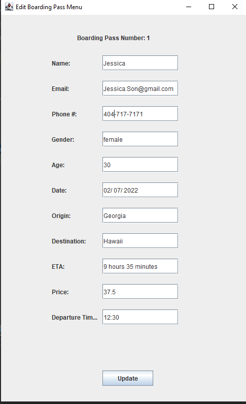
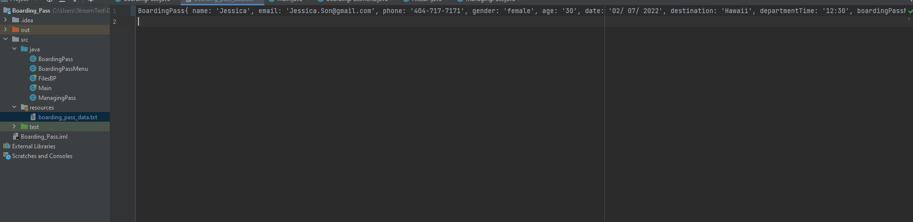
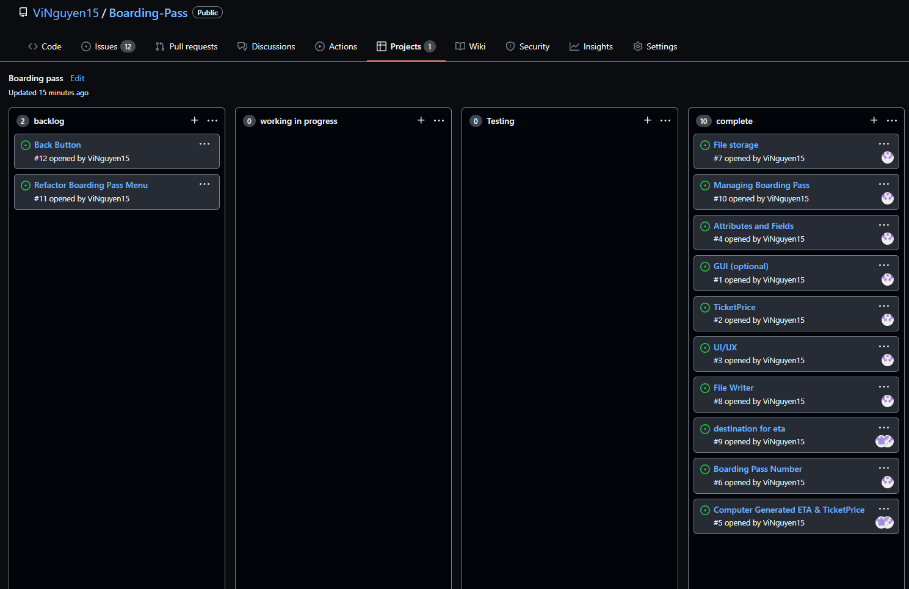

# Boarding-Pass

User gets to choose either to create or edit the boarding passes
GUI has been included for customer's UI/UX

  

Upon clicking the New Boarding Pass button user will be requested to fill out some information

  

After the User fills out the survey they will be auto assigned a unique boarding pass number and 
their information will be stored into a textfile and a prompt will display a calculation of time estimation and price 

  

  

  

If the User clicked the Edit button from before a new window will pop up asking them to select a boarding pass base on their unique number

  

  

After boarding pass number have been selected the User will be able to edit any changes they wish and when update button has been click the textfile will be updated accordingly

  

  

  

### Team Member:
1. **Vi Nguyen**
2. **Essien B**

  

